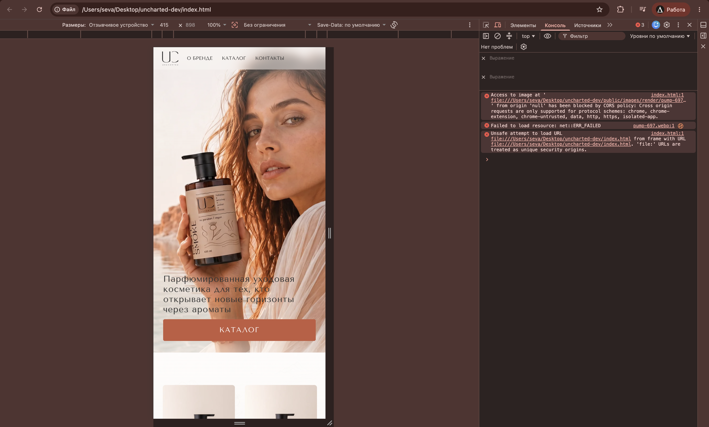
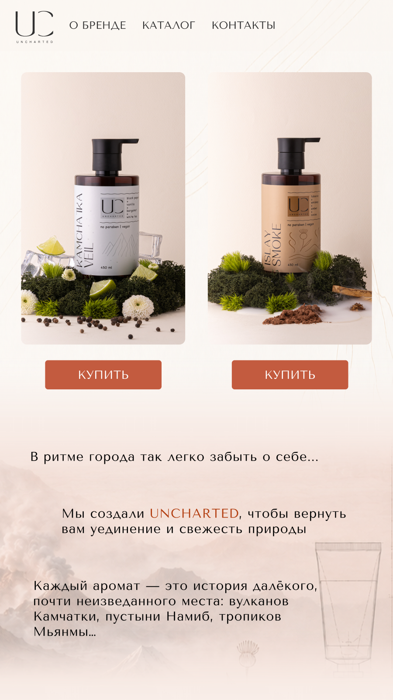
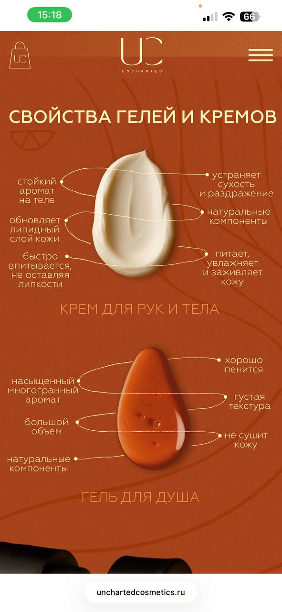
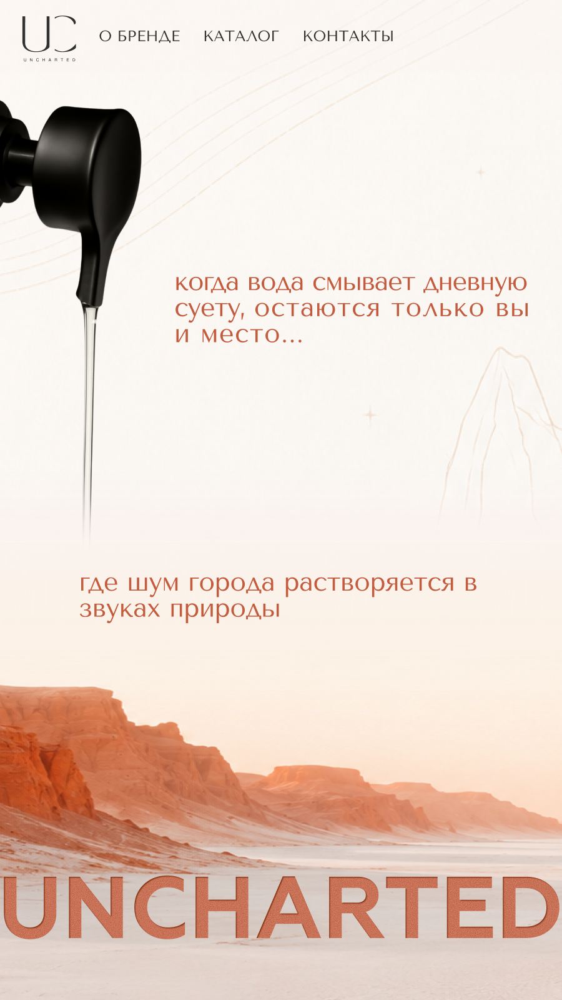
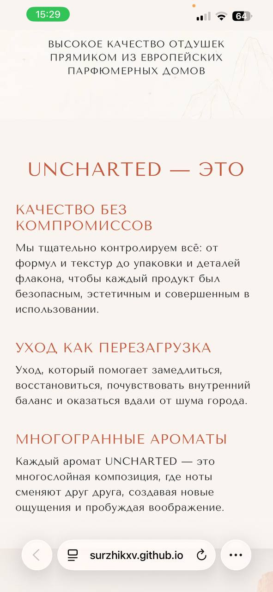

# Mobile Redesign Handoff

Цель: переделать мобильную версию главной страницы UNCHARTED почти с нуля по Figma и референсам. Текущая мобильная версия после прошлой правки неудовлетворительная, ее не надо аккуратно "дотюнивать" мелкими правками. Лучше заново собрать мобильный flow в `index.html` + `mobile.css`, сохранив desktop без изменений.

Figma:
https://www.figma.com/design/0oOzxMla9AEFWsIQ8FgOCv/%D0%B2%D1%81%D0%B5-%D0%BF%D1%80%D0%BE%D0%B5%D0%BA%D1%82%D1%8B?node-id=923-1613&t=UVVJicnssqPK18mL-4

Фреймы идут слева направо:

1. `923:1613` — первый экран с девушкой.
2. `924:1669` — каталог с двумя флаконами и блоком "В ритме города...".
3. `924:1736` — дозатор и фраза "когда вода смывает...".
4. `924:1809` — фон для текстового блока `UNCHARTED — ЭТО`.

## Самая первая проблема

Девушка должна занимать весь первый экран сразу при входе на сайт. Сейчас это не так: hero выглядит как обрезанная вставка, текст налезает на флакон, а снизу уже виден следующий блок каталога.

Требование к первому экрану:

- высота hero на мобильном должна быть `100svh` или очень близко к этому;
- в первом viewport не должны показываться карточки каталога;
- фото девушки должно заполнять весь экран, как в Figma, а не выглядеть как частичный crop;
- навигация поверх изображения допустима, как в Figma;
- заголовок и CTA должны сидеть в нижней части hero, но не перекрывать флакон/лицо;
- CTA `КАТАЛОГ` должен быть белым текстом на терракотовой кнопке.

Текущий проблемный скрин:



Референс Figma для первого экрана:


## Нужный порядок мобильных секций

1. Hero с девушкой на весь экран.
2. Ниже каталог/карусель в тех же пропорциях, что Figma: сверху два флакона в карточках, кнопки `КУПИТЬ`, затем текстовый блок:
   - "В ритме города так легко забыть о себе..."
   - "Мы создали UNCHARTED, чтобы вернуть вам уединение и свежесть природы"
   - "Каждый аромат — это история далёкого..."
3. Секция с "каплями" и подписями свойств. Ориентироваться на приложенный reference, а не на текущий список пунктов.
4. Фрейм с дозатором и текстом:
   - "когда вода смывает дневную суету, остаются только вы и место..."
   - "где шум города растворяется в звуках природы"
5. Секция `АРОМАТЫ` остается как есть по логике и содержанию. Не ломать карусель ароматов.
6. На фоне из последнего Figma-фрейма разместить весь блок `UNCHARTED — ЭТО`; тексты брать из desktop/current HTML.
7. Футер.

## Референсы

Figma: каталог + текстовый блок:



Секция свойств с каплями, масштабом и подписями:



Figma: дозатор + цитата:



Figma: финальный фон:


Референс финального текстового блока `UNCHARTED — ЭТО`:



## Технические ограничения

- Проект статический: `index.html`, `styles.css`, `mobile.css`, `app.js`.
- Desktop-верстку `.page` и desktop `topbar` не трогать без необходимости.
- Править мобильную версию через дерево `.m` в `index.html` и стили `@media (max-width: 768px)` в `mobile.css`.
- Не открывать для проверки через `file://`. В таком режиме Chrome блокирует часть картинок/шейдеров по CORS. Проверять через локальный сервер:

```bash
python3 -m http.server 4173
```

Открывать:

```text
http://localhost:4173/index.html
```

## Что проверить перед сдачей

- На 390px и 430px нет horizontal overflow.
- Первый экран полностью занят hero с девушкой; каталог не виден до скролла вниз.
- Текст hero не перекрывает флакон и лицо.
- Два флакона в каталоге видны в правильном масштабе и пропорциях.
- "Капли" выглядят как цельный poster/reference, а не как обычный список пунктов.
- Дозатор не вызывает CORS ошибок при запуске через локальный сервер.
- `АРОМАТЫ` не сломаны.
- `UNCHARTED — ЭТО` расположен на фоне последнего Figma-фрейма, с текстом из desktop.
- Футер идет последним.
